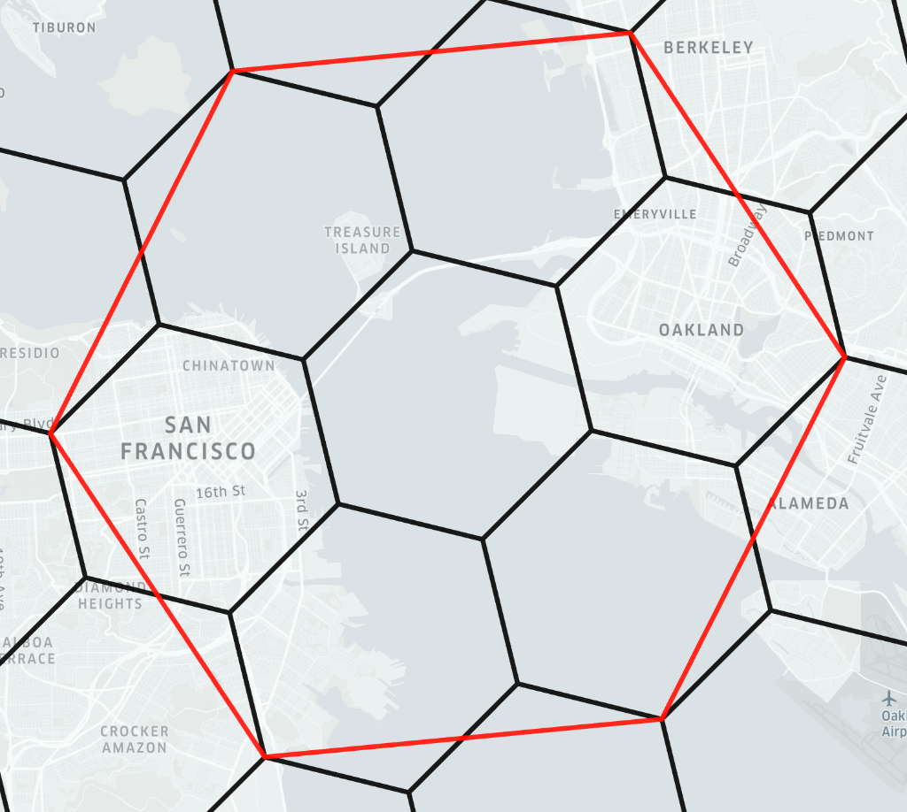
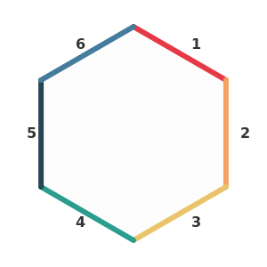

# Core Concepts

## H3 Hierarchy

[H3](https://h3geo.org/) is a hierarchical hexagonal grid system. Each cell at resolution `r` has 7 children at resolution `r+1`:
- 1 **center child** (position 0)
- 6 **edge children** (positions 1-6)

## Faces

A **face** is a boundary edge of a hexagonal cell. Each hexagon has **6 faces**, numbered 1-6.

> **Note**: The face numbering follows H3's internal child position convention, not geographic direction.

## Boundary Tracing

When a child cell is positioned at the edge of its parent, it "lies on" one or more of the parent's faces.

### Example
A child at position 1 may lie on faces 1 and 3 of its parent (depending on resolution parity).

### Face Mapping Tables

The library uses precomputed lookup tables that map:
- `(resolution_parity, child_position, child_face) → parent_face`

These tables differ for:
- **Even resolutions**: Children are rotated one way
- **Odd resolutions**: Children are rotated the opposite way
- **Pentagon parents**: Special 5-sided cases at the 12 H3 base pentagons

## Key Functions

### `trace_cell_to_parent_faces(h, input_faces)`
Given a cell `h` and a set of its own faces, returns which faces of its **parent** those map to.

### `trace_cell_to_ancestor_faces(h, input_faces, res_parent)`
Same as above, but traces up to any **ancestor** resolution.

### `cell_to_coarsest_ancestor_on_faces(h, input_faces)`
Finds the **lowest resolution** ancestor where `h` still lies on at least one of the specified faces.

### `children_on_boundary_faces(parent, target_res, input_faces)`
Returns all **descendants** at `target_res` that lie on the specified faces of `parent`.

## Use Cases

1. **Spatial Filtering**: Find all cells along a specific boundary of a region.
2. **Hierarchical Routing**: Optimize path-finding by focusing on boundary cells.
3. **Visualization**: Highlight which parts of a cell touch its parent's edge.
